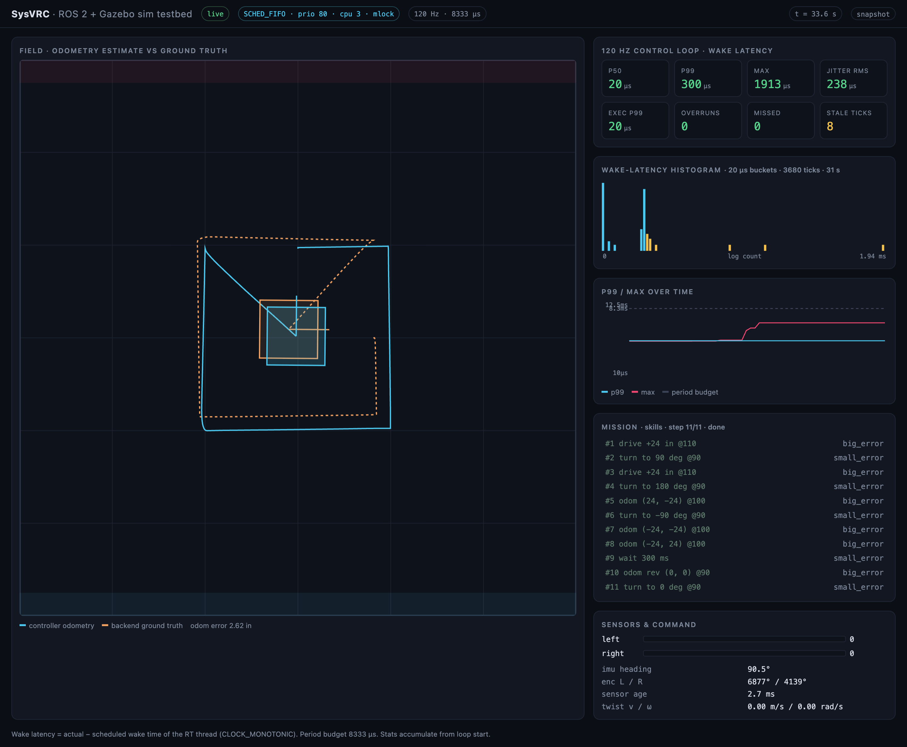
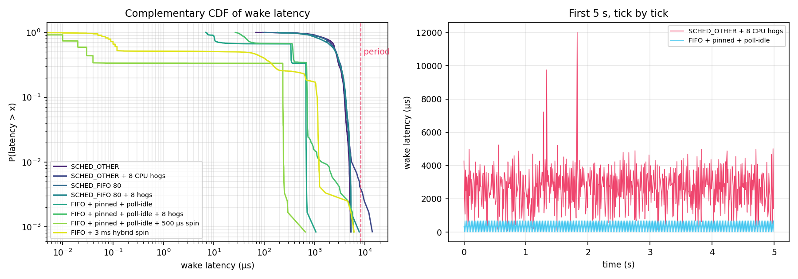

# SysVRC

A Linux-based robot simulation testbed for our VRC robot: **ROS 2 Jazzy +
Gazebo Harmonic** in front, the **same drive controllers the V5 brain runs**
in the middle, and a **120 Hz bounded-latency control loop** underneath, with
the instrumentation to prove the timing.

<p align="center"></p>

```
SysVRC/
  core/       header-only controllers shared by firmware and sim (PID, slew, cheesy drive, odometry, motion, plant)
  sim/        ROS 2 workspace: RT control loop, Gazebo model + field, fast plant backend, benchmark, dashboard
  v5/         PROS competition firmware for the V5 brain (EZ-Template + LemLib)
  docs/       architecture, latency measurements, benchmark data, replay
```

## Why

Tuning autonomous routines on the real robot costs a field, a charged
battery and a teammate. The testbed lets the drive PID, odometry and motion
sequencing run pre-integration: same gains, same exit conditions, same
control code, against physics — and it makes the loop timing observable so a
scheduling regression shows up as a number, not a wobble.

## Quick start

Everything runs in a container (Ubuntu 24.04, multi-arch — native on Apple
Silicon). You need Docker.

```bash
docker compose -f sim/docker/compose.yaml build
sim/tools/build.sh                                   # colcon build inside the container
```

Kinematic backend (no GPU, deterministic, what CI runs):

```bash
docker compose -f sim/docker/compose.yaml run --rm --service-ports sim \
  ros2 launch visbot_control plant.launch.py mission:=skills cpu:=3 poll_idle:=true spin_us:=500
```

Gazebo backend (headless; add `gui:=true` with an X display):

```bash
docker compose -f sim/docker/compose.yaml run --rm --service-ports sim \
  ros2 launch visbot_gazebo sim.launch.py mission:=skills cpu:=3 poll_idle:=true spin_us:=500
```

Then open **http://localhost:8080** — the dashboard shows the field with the
controller's odometry against the backend's ground truth, the mission step
list with exit reasons, and the RT loop's live wake-latency histogram.

Missions: `skills` (11-step skills-style loop), `mogo_rush` (opening of the
match auton), `square`. Scheduling: `sched:=fifo|rr|other`, `cpu:=N`,
`poll_idle:=true|false`, `spin_us:=N`.

## The control loop

`controller_node` runs the controller on its own `SCHED_FIFO` thread with
locked memory and absolute-deadline sleeps, never on a ROS timer. Sensor
samples reach it through lock-free stamped mailboxes; outputs leave through a
try-lock box to a publisher thread. Every tick's wake latency and execution
time go into histograms published on `/visbot/control_stats`.
[docs/architecture.md](docs/architecture.md) walks through it.

### Measured (docs/latency.md)

`rt_bench` runs the real controller + plant tick under each scheduling
configuration, 10 s each, 120 Hz, in a Docker Desktop VM on Apple Silicon.
A VM halts idle vCPUs so bare timer wakeups are coarse here (~3 ms); the
relative effect of each mitigation is the point.

| configuration | p50 | p99 | max | missed deadlines |
|---|---:|---:|---:|---:|
| SCHED_OTHER + 8 CPU hogs | 2720 µs | 6060 µs | 32783 µs | 8 |
| SCHED_FIFO 80 + 8 hogs | 2640 µs | 5160 µs | 7763 µs | 0 |
| FIFO + pinned + poll-idle | 360 µs | 700 µs | 1070 µs | 0 |
| FIFO + pinned + poll-idle + 500 µs spin | **20 µs** | **260 µs** | **659 µs** | 0 |



Reproduce:

```bash
docker compose -f sim/docker/compose.yaml run --rm sim sim/tools/bench.sh 10 3
docker compose -f sim/docker/compose.yaml run --rm sim python3 sim/tools/plot_latency.py
```

## Shared controllers (`core/`)

Header-only C++17 with no dependencies, compiled by both the PROS build
(`v5/common.mk` adds it to the include path) and the ROS 2 packages:

| header | what | from |
|---|---|---|
| `cheesy_drive.hpp` | operator mixer: sine turn remap, negative inertia, quick-stop | `v5/src/subsystemFiles/drive.cpp` |
| `pid.hpp` | PID with `start_i`, sign-flip reset, small/big/velocity exit conditions, rate-invariant kD | EZ-Template semantics |
| `constants.hpp` | drive/heading/turn/odom gains, exit conditions, slew | `default_constants()` in `v5/src/autons.cpp` |
| `odometry.hpp` | encoder + IMU arc dead-reckoning | ez::Drive odom (no tracking wheels) |
| `motion.hpp` | `driveDistance` / `turnTo` / `driveToPoint` / `wait` mission steps | `pid_drive_set` / `pid_turn_set` / `pid_odom_set` |
| `plant.hpp` | kinematic diff-drive with motor lag, encoder quantisation, IMU noise | — |

Tests run natively, no ROS needed:

```bash
cmake -S core -B build/core && cmake --build build/core && ctest --test-dir build/core --output-on-failure
```

They include closed-loop checks (drive 24 in converges within 1 in, turns take
the shortest path, the full skills loop completes and returns to origin with
< 3 in error) and a check that the EZ gains give identical derivative action
at 100 Hz and 120 Hz.

## Sim packages (`sim/src/`)

| package | contents |
|---|---|
| `visbot_control` | `rt_loop.hpp`, `latest_value.hpp`, `controller_node`, `plant_node`, `rt_bench`, gtests |
| `visbot_msgs` | `ControlStats` (timing histograms), `ControlState` (pose, mission, command) |
| `visbot_description` | `visbot.urdf.xacro`: 15×15 in chassis, 3.25 in wheels on a 12.5 in track, IMU @200 Hz, joint states @100 Hz, diff-drive with V5-like accel limits |
| `visbot_gazebo` | 12 ft VRC field world (1 kHz ODE), `ros_gz_bridge` config, `sim.launch.py` |
| `visbot_dash` | websocket telemetry + the browser dashboard; `record:=file.jsonl` writes a replay, `POST /snapshot` saves the page as PNG |

A recorded Gazebo run ships in `docs/replay/skills_gazebo.jsonl`; to watch it without ROS:

```bash
cp docs/replay/skills_gazebo.jsonl sim/src/visbot_dash/web/ && (cd sim/src/visbot_dash/web && python3 -m http.server 8080)
# then open http://localhost:8080/?replay=skills_gazebo.jsonl
```

## CI

`.github/workflows/ci.yml` builds `core/` on the host and runs its tests,
then builds the container, runs `colcon test`, runs the plant-backend
end-to-end check (mission completes, 0 overruns, bounded p99) with
`CAP_SYS_NICE`, and finally launches headless Gazebo to confirm the robot
spawns and all three sensor topics bridge at their configured rates.

## Firmware (`v5/`)

The PROS project, unchanged apart from moving into its own folder and picking
up `core/include`. See [v5/README.md](v5/README.md) for building and
flashing.
