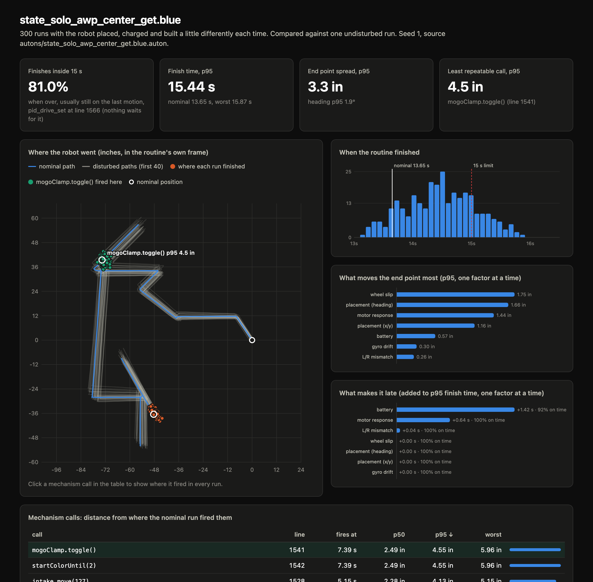

# SysVRC

Sim testbed for our VRC robot. It runs our actual autons, imported straight from `autons.cpp`, through a port of the same EZ-Template drive code the V5 brain runs. You can check an auton for consistency hundreds of times without a field, or watch it in ROS 2 + Gazebo on a 120 Hz control loop that holds its timing.

The idea: testing autons on the real robot costs a field, a charged battery and a teammate, and it still doesn't tell you *why* a routine works 8 times out of 10. Here you run the same code against a model of the drivetrain, with the things that change between runs (placement, battery, slip, gyro drift) varied on purpose, and see what breaks.



## Check your autons (no ROS needed)

This is the part most teams will want. Two steps: import your routines, then check them.

**1. Import.** `tools/ez_import.py` reads EZ-Template code and writes one `.auton` file per routine:

```bash
python3 tools/ez_import.py v5/src/autons.cpp v5/src/skills.cpp --all -o autons
```

It handles the stuff autons are actually made of: EZ calls, wrappers like our `set_drive`, `if (isBlue)` branches, timed `while` loops that push with `drive_set`, and helper functions in the same file. Anything it can't work out ahead of time (an `if` on a distance sensor, a drive length computed from the live odom pose) is listed by line number and marked `NOT IMPORTED` in the file. It never guesses silently. Red side is `--bind isBlue=false`. If your team wraps EZ calls differently, add your wrapper to `ALIASES` at the top of the script.

Of our 18 routines, 16 import with nothing left out.

**2. Check.** `auton_check` runs a routine once clean, then a few hundred times with realistic variation, and tells you whether it finishes in time, how far each mechanism call lands from where it should, and which disturbance is to blame:

```bash
cmake -S core -B build/core && cmake --build build/core
build/core/auton_check autons/state_solo_awp_center_get.blue.auton --html report.html
```

No cmake? It's one file: `c++ -std=c++17 -O2 -Icore/include -Icore/tools core/tools/auton_check.cpp -o auton_check`.

What it found in our code on the first run:

* `stateSoloAwpCenterGet` finishes inside 15 s in only 81% of runs. The last drive toward the ladder has no wait after it, and it's what's still going at the buzzer. The late runs are almost all low-battery runs: every battery at full, 100%; every battery at 85%, 36%.
* `safeFourRing` has a `pros::delay(20000)` at line 1232 with more code after it, so that code never runs in a match.
* `positiveSideQuals` swings with speed `-100` on lines 1383 and 1387. EZ throws away the sign of every speed, so those were never backwards swings.

Every routine at once, one line each:

```bash
for f in autons/*.auton; do build/core/auton_check "$f" --brief; done
```

The report is the field with your routine on it. Scrub the timeline and all the runs move with it as faint outlines, so you can see where they come apart. Your code runs down the side with each wait's exit and each mechanism call's spread, and whatever is still running at the buzzer is marked. Pick High Stakes, skills or Override from the dropdown, flip red/blue, and if your routine starts at (0, 0) drag the robot to where you actually put it.

More on the disturbance model, the flags, the report, and what the numbers can and can't tell you: [docs/auton_check.md](docs/auton_check.md).

## Your robot in the sim

By default the sim drives a generic 15 in box with our drivetrain. The robot studio swaps in yours. Drop in a STEP export of the CAD and it reads the parts: motors and cartridges, wheels, gear teeth, pistons, sensors. It works out the drivetrain and where each mechanism is, and reads your code for the chassis constructor, motor names and helpers. With an `ANTHROPIC_API_KEY` it has Claude look at renders of the robot plus the code to work out what each mechanism is and what `ChangeLBState(EXTENDED)` actually does. You check it, fix what's wrong, and save.

```bash
python3 -m pip install -r tools/robot_studio/requirements.txt
python3 tools/robot_studio serve                    # http://localhost:8090
build/core/auton_check autons/state_solo_awp.blue.auton --robot robots/ours/robot.json --html report.html
```

With a robot, the report runs the game elements too. It shows the rings your intake picks up, the goals your clamp gets (or misses, and by how much), what the lady brown scores, points at the buzzer and the AWP checklist, across all the varied runs. Paths drawn in path.jerryio import with `tools/path_import.py`. More in [docs/robot_studio.md](docs/robot_studio.md), and the file format in [docs/robot_spec.md](docs/robot_spec.md).

## What lives where

```text
SysVRC/
  core/    the drive controllers (header-only C++, no deps) + auton_check
  autons/  our routines as .auton files, generated from v5/src by the importer
  robots/  robot.json for each robot the sim knows (ours, plus whatever the studio saves)
  tools/   ez_import.py, path_import.py, build_web.py, robot_studio/
  web/     the report page and the field drawing (build_web.py bakes them into auton_check + the dashboard)
  sim/     ROS 2 workspace (control loop, gazebo model + field, dashboard, scripts)
  v5/      our PROS competition code, same as it always was
  docs/    how it works, what matches EZ and what doesn't, latency numbers
```

### `core/`

The controllers with the hardware calls ripped out: EZ-Template's PID, slew and motion tasks, cheesy drive from `drive.cpp`, encoder + IMU odometry, and a simple kinematic drivetrain model.

It's a port of EZ-Template v3.2.2 checked line by line against EZ's source, not a rewrite from the docs. EZ has some weird behavior (the integral reset compares against the wrong variable, `big_error` exits can never fire if you also set `small_error`, negative speeds are silently made positive). The port keeps all of it on purpose, because that's what the robot actually does. [docs/fidelity.md](docs/fidelity.md) lists every quirk, the test that pins it, and what isn't ported (boomerang, pure pursuit, motor current exits).

Gains are in `core/include/visbot/constants.hpp`. They're copied from `default_constants()` in `v5/src/autons.cpp`, so if you retune on the robot, update both. The firmware has `core/include` on its include path but doesn't use any of it yet.

### `autons/`

Generated, but committed, so you can read a routine without the C++ around it. Each line keeps the source line number (`@1977`) and the original call when it's not obvious:

```text
pid_drive_set(36, 127)       @1977  # set_drive(32 + 4, 2500, 126, 127)
pid_wait_until(6)            @1984  # chassis.pid_wait_until(12 - 6)
action("rightDoinker.toggle()")  @1986
```

CI fails if these get out of date with `v5/src`, so re-run the importer after you edit an auton.

### `sim/`

Five ROS 2 packages. The important one is `visbot_control`:

* `controller_node` runs the controller on its own SCHED_FIFO thread, not a ROS timer. Absolute-deadline sleeps, locked memory, lock-free handoff to and from the ROS side, no allocation on the realtime thread. Every tick's wake latency goes into a histogram on `/visbot/control_stats`.
* `plant_node` is a fast fake robot for when you don't need Gazebo. Deterministic, which makes it good for CI.
* `rt_bench` measures loop latency with no ROS at all.

The rest: `visbot_description` (robot model), `visbot_gazebo` (12 ft field + launch), `visbot_msgs`, and `visbot_dash` (the browser dashboard). [docs/architecture.md](docs/architecture.md) goes through how the pieces connect.

### `v5/`

Mostly the old repo, moved into a folder. See [v5/README.md](v5/README.md). Heads up: `v5/include/` and `project.pros` were never committed, so `pros make` won't work from a fresh clone until those are added back.

## Running the full sim

This part needs Docker. Everything runs in a Linux container, and it works natively on Apple Silicon.

```bash
docker compose -f sim/docker/compose.yaml build
sim/tools/build.sh                                   # colcon build inside the container
```

The first image build takes a while. Build output lives in docker volumes, so rebuilds after that are quick. Inside the container you start in `/ws` and the repo is mounted at `/ws/src/sysvrc`, which is why the tool commands below start with `src/sysvrc/`.

Fake robot, no Gazebo (fast, what CI uses):

```bash
docker compose -f sim/docker/compose.yaml run --rm --service-ports sim \
  ros2 launch visbot_control plant.launch.py mission:=state_solo_awp.blue cpu:=3 poll_idle:=true spin_us:=500
```

Gazebo (headless by default):

```bash
docker compose -f sim/docker/compose.yaml run --rm --service-ports sim \
  ros2 launch visbot_gazebo sim.launch.py mission:=worlds_mogo_rush.blue cpu:=3 poll_idle:=true spin_us:=500
```

Then open http://localhost:8080. You get the field with the robot where it really is and a dashed outline where odometry thinks it is, the routine's lines with how each wait exited, mechanism calls on the path, the match clock, and the loop's wake latency.


`mission:=` takes the name of anything in `autons/` (`worlds_mogo_rush.blue`), a path to an `.auton` file, or one of the built-ins (`skills`, `square`, `chain`). The robot spawns where the routine starts: its `# @field_start` if it has one, otherwise its `odom_xyt_set`.

`robot:=robots/<name>` runs a robot from the studio instead of the default drivebase: its wheels, size and speed in Gazebo with its CAD as the visual, and live scoring on the dashboard. Other launch args: `sched:=fifo|rr|other`, `cpu:=N` (pin the loop to a core), `poll_idle:=true`, `spin_us:=N`, `dash:=false`, `record:=file.jsonl`. Gazebo also takes `gui:=true`, but that needs an X display. On a Mac it's easier to just use the dashboard.

## Tests

Core, auton_check and the importer, no ROS needed:

```bash
cmake -S core -B build/core && cmake --build build/core && ctest --test-dir build/core --output-on-failure
python3 -m unittest discover -s tools/tests
```

That's 76 core tests (closed-loop convergence for every motion type, each EZ quirk, kD/kI giving the same result at 100 Hz and 120 Hz, every imported routine running start to finish, robot.json parsing), 4 auton_check checks, 17 importer tests, 7 path import tests, and a check that the generated web files are up to date (edit `web/`, then run `python3 tools/build_web.py`). The studio and the element sim have their own:

```bash
python3 -m unittest discover -s tools/robot_studio/tests     # 26, on a fixture robot whose parts are known
node --test web/tests/                                       # 9, the High Stakes element sim
```

Everything else, plus the end-to-end checks over real ROS topics and in Gazebo:

```bash
docker compose -f sim/docker/compose.yaml run --rm sim bash -lc "colcon test && colcon test-result --all"
docker compose -f sim/docker/compose.yaml run --rm sim src/sysvrc/sim/tools/smoke_test.sh 24 state_solo_awp.blue fifo 3 true 500
docker compose -f sim/docker/compose.yaml run --rm sim src/sysvrc/sim/tools/gazebo_smoke.sh 30 square 6.0
```

CI (`.github/workflows/ci.yml`) runs all of this on every push to main and every PR.

## Latency

`rt_bench` runs the real controller + plant tick under different scheduling setups, 10 s each at 120 Hz. These were measured in Docker Desktop on a Mac. The VM halts idle vCPUs, so plain timer wakeups are coarse (~3 ms); what matters is the difference each fix makes.

| setup | p50 | p99 | max | missed deadlines |
|---|---:|---:|---:|---:|
| SCHED_OTHER + 8 CPU hogs | 2720 µs | 6060 µs | 32783 µs | 8 |
| SCHED_FIFO 80 + 8 hogs | 2640 µs | 5160 µs | 7763 µs | 0 |
| FIFO + pinned + poll-idle | 360 µs | 700 µs | 1070 µs | 0 |
| FIFO + pinned + poll-idle + 500 µs spin | 20 µs | 260 µs | 659 µs | 0 |

Full table and plot in [docs/latency.md](docs/latency.md). To rerun:

```bash
docker compose -f sim/docker/compose.yaml run --rm sim src/sysvrc/sim/tools/bench.sh 10 3
docker compose -f sim/docker/compose.yaml run --rm sim python3 src/sysvrc/sim/tools/plot_latency.py
```

## Watching a recorded run

There's a Gazebo run of our skills routine in `docs/replay/`. You can play it back without ROS:

```bash
cp docs/replay/skills_gazebo.jsonl sim/src/visbot_dash/web/ && (cd sim/src/visbot_dash/web && python3 -m http.server 8080)
# then open http://localhost:8080/?replay=skills_gazebo.jsonl
```

Drag the timeline to scrub, space to play, `#t=24` on the URL to open at 24 s. Watch the odometry outline fall behind after the corner pushes: the wheels keep counting while the robot is pinned against the wall. That run was Gazebo in Docker Desktop on a Mac, which is not a realtime host, so ignore its loop latency (61 missed deadlines); see the latency section for what the loop does on a quiet core.

## Quick troubleshooting

* `auton_check` warns that a routine "pushes with drive_set": the routine starts at (0, 0), so the sim doesn't know where the walls are and a timed shove drives through open field instead. Open the report, drag the robot to its real start, and rerun with the `--field-start X,Y,HEADING` it gives you. (A routine whose `odom_xyt_set` already uses field coordinates doesn't need this.)
* The importer says `NOT IMPORTED` somewhere: that line depended on the robot at runtime (a sensor, the live pose). The sim runs the routine without it, so treat the results after that line with suspicion.
* "Cannot connect to the Docker daemon": Docker Desktop isn't running. Open it and wait a few seconds.
* Controller log says `pthread_setschedparam ... failed`: the container doesn't have CAP_SYS_NICE. The compose file adds it; with plain `docker run`, add `--cap-add=SYS_NICE --ulimit rtprio=99 --ulimit memlock=-1`. The loop still runs without it, just not realtime.
* Latency in the milliseconds on a Mac: that's the VM. Use `cpu:=3 poll_idle:=true spin_us:=500`.
* Dashboard won't load: you probably left off `--service-ports`. It needs 8080 (page) and 8081 (websocket).
* Mission never starts: the controller waits for `/visbot/imu` and `/visbot/joint_states` before arming, so check that the backend is up. If the log says "no routine called ...", check the name against `ls autons/`.
