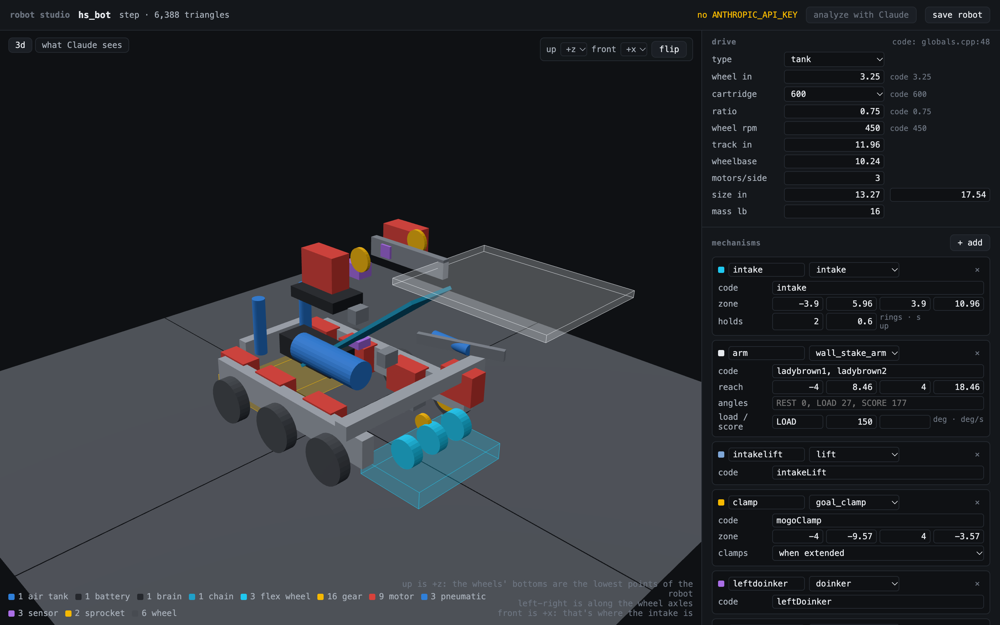

# Robot studio

Turns your robot's CAD and your code into a robot the sim can run: drivetrain, size, where the intake grabs, where the clamp holds a goal, how far the lady brown reaches, and which of your `action(...)` lines drive which mechanism. Then `auton_check`, the report, and Gazebo use that robot instead of a generic 15 in box.

```bash
python3 -m pip install -r tools/robot_studio/requirements.txt     # Python 3.12+
export ANTHROPIC_API_KEY=...                                       # optional, see below
python3 tools/robot_studio serve                                   # http://localhost:8090
```

Drop in a CAD export, check what it found, fix what it got wrong, save, pick a routine, run.



## What to export

STEP from Onshape (right-click the assembly, Export, STEP), Fusion or Inventor. STEP keeps the part names, and the VEX part libraries name everything ("V5 Smart Motor (11W)", "3.25in Omni Wheel", "36T High Strength Gear"), so the studio can count motors and read gear teeth. It also keeps the true cylinder radii, which is how it measures wheels.

STL, OBJ, GLB, PLY and 3MF work too, but they're just shape. The studio splits the mesh into separate bodies and finds wheels by size, and the front is a guess you can flip.

Big assemblies are fine. A full robot with every screw is a few hundred thousand triangles, which takes a few seconds.

## What it works out on its own

* **Which way is up**: the wheels' bottoms are the lowest points of the robot. **Left-right**: along the wheel axles. **Front**: the end with the intake. All three show in the corner of the 3D view, and up/front can be changed if it's wrong.
* **Drivetrain**: wheel size, wheels and motors per side (drive motors come in mirrored pairs, which tells them apart from a low intake motor), track width, wheelbase, and the gearing from the teeth on the gears sharing the wheel axles. A 36T driving a 48T on a blue cartridge is 450 rpm.
* **From your code** (`v5/src`, `v5/include`): the `ez::Drive` or `lemlib::Drivetrain` constructor, every `pros::Motor`/`MotorGroup` with its gearset, pistons, sensors, numeric constants, and the helper functions your autons call.
* **A first draft**: mechanisms named after your code's objects (`intake`, `mogoClamp`, `ladybrown1`...), zones placed from the CAD, and bindings for helpers that just pass a number to a motor (`void setIntake(int p) { intake.move(p); }`).

When code and CAD disagree (the constructor says 450 rpm, the gears say 480) it shows both. That's a real bug: EZ's odometry would read 6% short, and the sim reproduces it (see [robot_spec.md](robot_spec.md), `code`).

## What Claude adds

"Analyze with Claude" sends the four renders (the "what Claude sees" tab), the parts table, the measurements, the code facts, your helper functions and every distinct `action(...)` line to the Claude API, and gets back a filled-in robot.json. It's checked against the same schema as a hand-written file.

The draft can't tell that `ChangeLBState(EXTENDED)` swings the lady brown to 177°, or that `startColorUntil(1)` means "hold the next ring of our colour". Claude reads the helpers and the constants and works that out, places the zones from the renders, and lists what it isn't sure about under "check these".

It uses `claude-opus-5-5` by default (`STUDIO_MODEL` to change it) and one request per analysis. Nothing else leaves your machine. Without a key the studio still works; you get the draft and fill in the rest by hand.

## Fixing it

Everything in the right-hand column is editable: drive numbers, each mechanism's zone (robot frame, inches, +y forward), the clamp's polarity, the arm's angles, and the bindings table that maps action text to mechanisms. The line under the table says which of your routines' calls still don't do anything. Some don't need to, like brake modes and sensor flags.

Save writes `robots/<name>/`:

* `robot.json`, the spec ([format](robot_spec.md))
* `model.glb`, the CAD in the robot frame
* `views.png`, the renders

## Using the robot

```bash
build/core/auton_check autons/state_solo_awp.blue.auton --robot robots/ours/robot.json --html report.html
```

The report then draws your robot's outline and simulates the game elements (High Stakes for now). Rings get picked up when the intake is running and its mouth goes over them. Goals get pushed by the chassis, seated in the clamp and carried. The lady brown scores on a wall stake if one is in reach when it swings up. The header shows points at the buzzer, how many of the varied runs score that much, and the auton win point checklist. Each mechanism call in the code column shows what it did ("clamped", "missed, goal 6.3″ away", "+2 rings", "alliance stake") and how often that happened across the varied runs.

The full sim takes the same robot:

```bash
ros2 launch visbot_gazebo sim.launch.py mission:=state_solo_awp.blue robot:=robots/ours
ros2 launch visbot_control plant.launch.py mission:=state_solo_awp.blue robot:=robots/ours
```

Gazebo gets the robot's wheels, track, size, mass, speed and acceleration, with the CAD as the visual. The controller uses what your code declares, the plant uses the robot as built, and the dashboard scores the run live.

Without the browser:

```bash
python3 tools/robot_studio analyze robot.step --name "our bot" [--ai] [--front -x]
```

## Path plans

Paths drawn in [path.jerryio](https://path.jerryio.com) (LemLib export) become routines:

```bash
python3 tools/path_import.py ring_run.txt -o autons/ring_run.auton
```

The path is followed as a chain of `pid_odom_set` moves every 8 in (`--spacing`), starting at its first point. EZ's pure pursuit isn't ported, so corners are approximate. Add `action("...")` lines by hand where the mechanisms run.

## Limits

* **Rough on purpose.** The robot drives through rings, and rings don't roll. A ring rides the conveyor at a fixed rate. Goals get shoved but don't tip. The arm swings at a fixed speed. It's good for "does the clamp fire with a goal under it" and "does this routine score 7 or 3", not for ring physics.
* **High Stakes only** for the element sim. Override (2026-27) is drawn but not scored yet.
* **Zones are boxes on the floor**, seen from above. A mechanism that grabs at height is approximated by where it would be over the floor.
* **The AI can be wrong.** That's why everything it says is editable and it lists its guesses. Check the questions before trusting a score.
